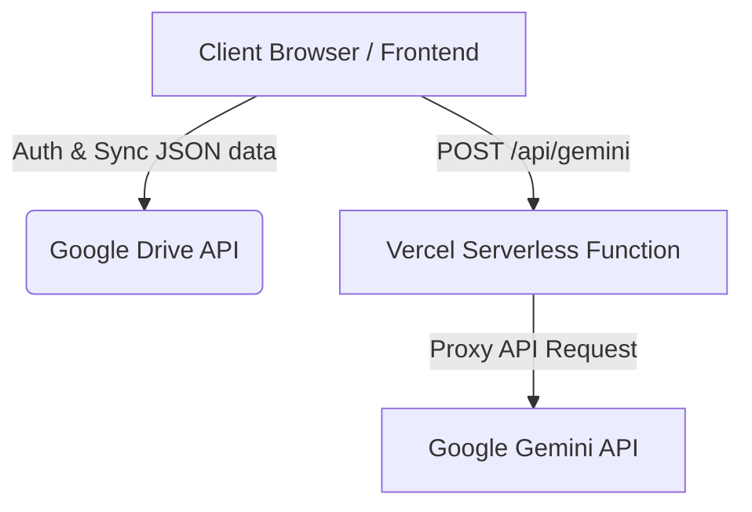

# MyMindSpace 🧠

A private, ultimate-secure, and always-free digital canvas and spatial mind-map. Save notes, links, and files directly to your Google Drive with zero tracking or subscription fees. Powered by Gemini AI to organize, map, and chat with your thoughts.

---

## 🏗️ Architecture Overview

MyMindSpace runs entirely client-side inside the user's browser, communicating directly with Google Drive for data storage. For AI features, it communicates with Vercel serverless functions which proxy requests to the Google Gemini API.



---

## 🔑 How the Gemini API Key is Picked Up

MyMindSpace checks and resolves the Gemini API key in the following order of precedence:

1. **Client-Side Settings (Local Storage)**:
   - Users can input their own Gemini API key inside the app's **Settings (⚙️)** panel.
   - If configured, this key is saved in browser local storage (`mymind_gemini_key`) and sent with requests to `/api/gemini?key=<YOUR_KEY>`.

2. **Server-Side Environment Variable**:
   - If the request to `/api/gemini` does not include a client-side key, the serverless proxy fallback is activated.
   - If the logged-in user email is `chakshu.grover8@gmail.com`, the API handler retrieves the key from `process.env.GEMINI_API_KEY` defined on the server side (Vercel).

3. **Client-Side Fallback Tagging**:
   - If no API key is specified and the user is not the designated owner, the app falls back to client-side automatic tagging (`mockAnalysis` in `app.js`) without querying the API.

---

## 🚀 How to Deploy on Vercel

Since the project is already structured for Vercel (complete with `vercel.json` and a serverless `api/` directory), deployment is straightforward.

### Step 1: Push Repository to GitHub/GitLab
Ensure your repository is pushed to your Git provider (e.g., GitHub):
```bash
git add .
git commit -m "Add README and documentation"
git push origin main
```

### Step 2: Import Project on Vercel
1. Go to your [Vercel Dashboard](https://vercel.com/dashboard).
2. Click **Add New > Project**.
3. Import the repository `my-mindspace`.

### Step 3: Configure Environment Variables
Before deploying, add the following environment variable in the Vercel project configuration page:
- **Key**: `GEMINI_API_KEY`
- **Value**: *Your Google AI Studio Gemini API Key*

### Step 4: Configure Google OAuth credentials
Since MyMindSpace accesses Google Drive, the Google Client ID needs to authorize your Vercel deployment domain:
1. Go to the [Google Cloud Console](https://console.cloud.google.com/).
2. Select your project and navigate to **APIs & Services > Credentials**.
3. Edit your OAuth 2.0 Client ID.
4. Add your Vercel deployment URL (e.g., `https://mymindpalace.vercel.app`) to both:
   - **Authorized JavaScript origins**
   - **Authorized redirect URIs** (if applicable)
5. Save changes.

---

## 🛠️ Local Development

To run the project locally without deploying:

1. Install Vercel CLI (optional, to run serverless functions locally):
   ```bash
   npm i -g vercel
   ```
2. Start the local dev server:
   ```bash
   vercel dev
   ```
   *Alternatively, run a local Python HTTP server if you do not need serverless functions:*
   ```bash
   python3 server.py
   ```
